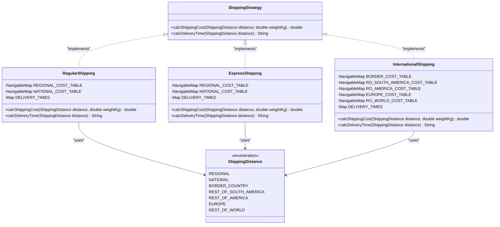

# Diagrama UML de la solución

```mermaid
classDiagram
    class ShippingStrategy {
        +calcShippingCost(ShippingDistance distance, double weightKg) double
        +calcDeliveryTime(ShippingDistance distance) String
    }
    
    class RegularShipping {
        -NavigableMap<Double, Double> REGIONAL_COST_TABLE
        -NavigableMap<Double, Double> NATIONAL_COST_TABLE
        -Map<ShippingDistance, String> DELIVERY_TIMES
        +calcShippingCost(ShippingDistance distance, double weightKg) double
        +calcDeliveryTime(ShippingDistance distance) String
    }

    class ExpressShipping {
        -NavigableMap<Double, Double> REGIONAL_COST_TABLE
        -NavigableMap<Double, Double> NATIONAL_COST_TABLE
        -Map<ShippingDistance, String> DELIVERY_TIMES
        +calcShippingCost(ShippingDistance distance, double weightKg) double
        +calcDeliveryTime(ShippingDistance distance) String
    }

    class InternationalShipping {
        -NavigableMap<Double, Double> BORDER_COST_TABLE
        -NavigableMap<Double, Double> RO_SOUTH_AMERICA_COST_TABLE
        -NavigableMap<Double, Double> RO_AMERICA_COST_TABLE
        -NavigableMap<Double, Double> EUROPE_COST_TABLE
        -NavigableMap<Double, Double> RO_WORLD_COST_TABLE
        -Map<ShippingDistance, String> DELIVERY_TIMES
        +calcShippingCost(ShippingDistance distance, double weightKg) double
        +calcDeliveryTime(ShippingDistance distance) String
    }
    
    class ShippingDistance {
        <<enumeration>>
        REGIONAL
        NATIONAL
        BORDER_COUNTRY
        REST_OF_SOUTH_AMERICA
        REST_OF_AMERICA
        EUROPE
        REST_OF_WORLD
    }

    ShippingStrategy <|.. RegularShipping : "implements"
    ShippingStrategy <|.. ExpressShipping : "implements"
    ShippingStrategy <|.. InternationalShipping : "implements"
    
    RegularShipping --> ShippingDistance : "uses"
    ExpressShipping --> ShippingDistance : "uses"
    InternationalShipping --> ShippingDistance : "uses"

```
